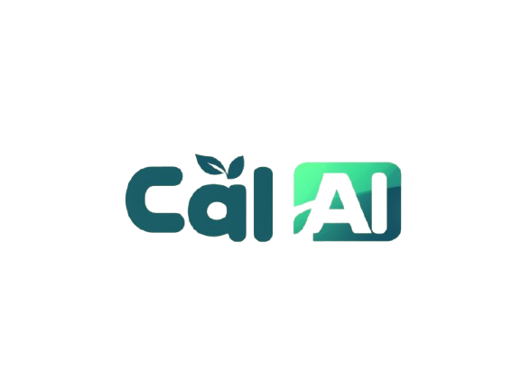

# CAL AI - Automatic Food Ingredient Detection 🍽️
<p align="center">
  
</p>
<!-- Alternative: Pour une bannière large -->
<!--  -->
<!-- Alternative: Pour un logo avec un lien -->
<!-- <p align="center">
  <a href="https://calai-project.com">
    
  </a>
</p> -->
## ✨ Description
CAL AI is a project aimed at revolutionizing nutritional management through artificial intelligence. Our solution analyzes food images to automatically detect ingredients, estimate their weight, and calculate associated nutritional values.

This repository currently contains the **project's landing page**, deployed to present the concept and planned features.

## 📑 Current Content
* **Landing Page**: An interactive webpage introducing the project, its goals, and features
* **Calorie Calculator**: A functional demo allowing users to calculate their caloric needs based on their measurements and physical activity level

## 🛠️ Technologies Used

### Frontend
* **HTML5/CSS3**: Page structure and design
* **JavaScript (React.js)**: Interactive component for calorie calculator
* **Third-party Libraries**:
  * Swiper.js: Interactive carousels
  * ScrollReveal.js: Scroll animations
  * VanillaTilt.js: Interactive page element effects

### Backend (Planned)
* **FastAPI**: Request and analysis management
* **OpenAI Vision**: Image recognition for ingredient identification
* **MongoDB**: Database for storing analyzed meals

## 🚀 Current Features

### 1. Interactive Homepage
* Clear presentation of project objectives and concept
* Smooth navigation with responsive design
* Toggle between light and dark themes

### 2. Calorie Calculator
* Based on standard formulas for daily caloric needs estimation
* Considers gender, age, height, weight, and physical activity level

## 🌐 Online Demo
Access the landing page here: [Demo Link](#)

## 📝 Next Steps

### Image Analysis
* Using OpenAI Vision API to identify ingredients in food images

### Nutritional Calculation
* Precise estimation of calories, fats, proteins, and carbohydrates for each detected ingredient

### Dashboard
* Tracking analyzed meals and visualizing results

## 🧩 Local Installation and Execution

### Prerequisites
* **Node.js** (for frontend)
* **Python 3.8+** (for upcoming backend)
* **MongoDB** (local or hosted)

### Landing Page Setup Steps

1. **Clone this repository:**
   ```bash
   https://github.com/TBAHRITI-MED/cal-ai-landing-page.git
   cd cal-ai-landing-page
   ```

2. **Install frontend dependencies:**
   ```bash
   cd frontend
   npm install
   ```

3. **Launch the application:**
   ```bash
   npm start
   ```

4. Open your browser at: http://localhost:3000


## 📜 License
© 2025 CAL AI - All rights reserved.
